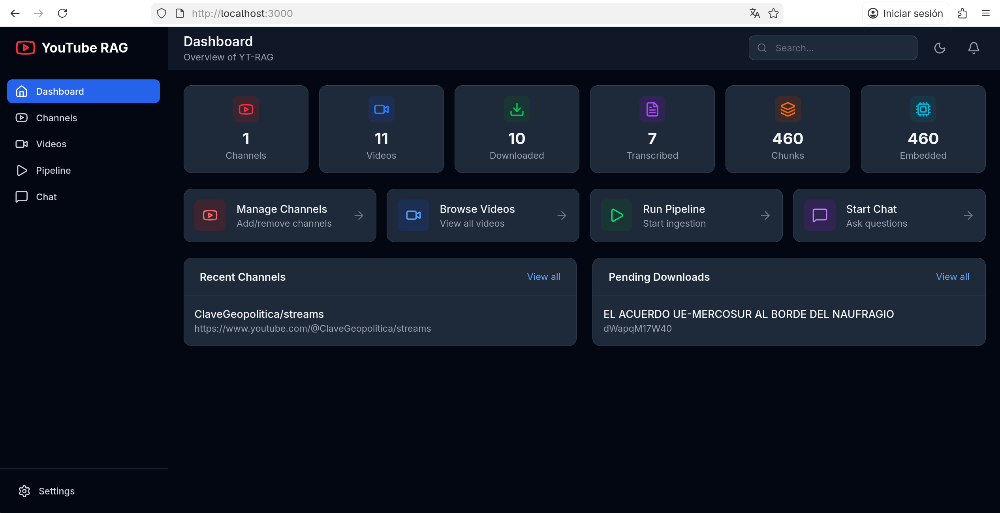
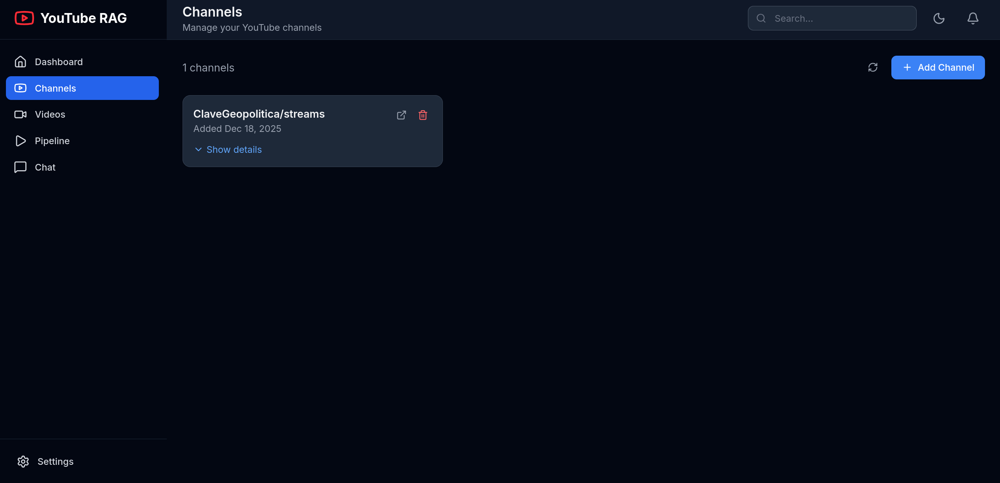
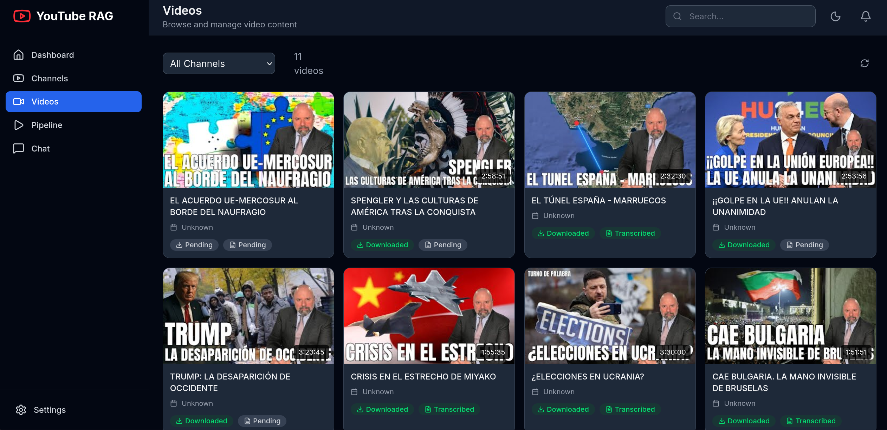
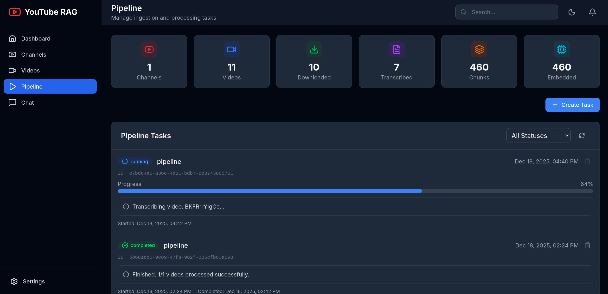
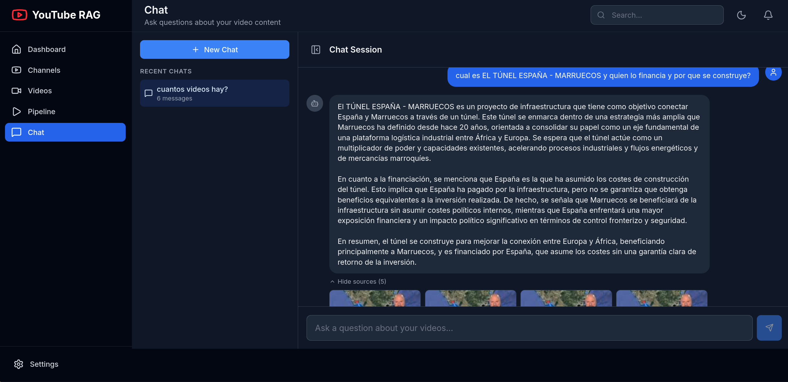

# Youtube-Rag

A local Retrieval-Augmented Generation (RAG) pipeline that ingests YouTube channels, transcribes content, creates embeddings, and allows you to "chat" with the videos using an LLM.

This project is especially useful for **divulgative, analytical, or opinion-based YouTube channels**, where the core value comes from the **ideas, arguments, and explanations**, not from real-time interaction or visual elements of the video itself.

Typical examples include channels focused on:
- Geopolitics (e.g. *Clave Geopolítica*)
- Economics and history
- Long-form analysis and commentary
- Educational or explanatory content

It is **not intended for live gaming streams or highly reactive content**, where the spoken information is fragmented, contextual, or not conceptually structured.

Built with **FastAPI**, **PostgreSQL (pgvector)**, **Docker**, and **React**.

---

## Overview

### 1. Dashboard
Get a high-level view of your ingested channels, total videos processed, and system health.


### 2. Channel Management
Add YouTube channels by URL. The system automatically fetches metadata and filters out live streams or shorts.


### 3. Video Library
View the status of individual videos. The system handles downloading, normalizing audio, and tracking metadata.


### 4. Processing Pipeline
Real-time tracking of the heavy lifting. The worker handles Transcription ➝ Chunking ➝ Embedding with granular progress bars.


### 5. Chat & Sources
Chat with your video knowledge base. Citations are linked directly to the specific timestamp in the video.


---

## Features

*   **Ingest:** Uses `yt-dlp` to fetch channel metadata, ignoring upcoming streams or live broadcasts.
*   **Audio Pipeline:** Downloads and normalizes audio to 16kHz WAV format automatically.
*   **Vector Search:** Stores embeddings in **PostgreSQL** using `pgvector` for efficient semantic search.
*   **Async Worker:** Dedicated worker container (GPU-enabled) handles transcription and embedding tasks without blocking the UI.
*   **Traceability:** Chat responses include citations pointing to exact video timestamps.

---

## Quick Start

1.  **Clone the repository**
    ```bash
    git clone https://github.com/sanchezhs/Youtube-Rag.git
    cd Youtube-Yag
    ```

2.  **Configure Environment**
    Create a `.env` file in the root directory (see `env.example`)

3.  **Run with Docker**
    ```bash
    docker-compose up --build
    ```

    *   **Frontend:** http://localhost:3000
    *   **Backend API:** http://localhost:8000/api/v1/docs
    *   **DB:** localhost:5432

---

## 📂 Project Structure

```text
.
├── backend/       # FastAPI application
├── frontend/      # React UI
├── worker/        # Background processing (GPU)
├── shared/        # Shared DB models and utilities
└── docker-compose.yaml
